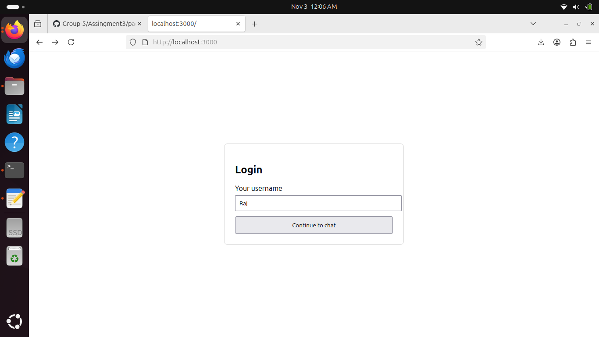

# Real-Time Private Chat Application

A modern real-time chat web application built using **Next.js**, **Socket.IO**, and **MongoDB**. 
Users can log in with a username, send and receive messages instantly, and view chat history saved in the database. 
This project demonstrates end-to-end full-stack communication with persistent storage and live updates.

---

## Project Overview

This chatapp is a simple, real-time chat app where multiple users can:
- Log in with a username.
- Send and receive messages instantly.
- See the complete chat history (fetched from MongoDB).
- Enjoy a clean, responsive UI.

The backend uses **Next.js API routes** and **Socket.IO** for real-time message exchange, while **MongoDB** stores all chat messages for persistence.

---

## 🛠️ Technologies Used

| Layer | Technology | Description |
|-------|-------------|-------------|
| Frontend | Next.js (React) | UI rendering and routing |
| Real-Time | Socket.IO | Bi-directional event-based communication |
| Database | MongoDB Atlas | Cloud-based MongoDB storage |
| Backend | Node.js (Next.js API routes) | Server-side message handling |
| Package Manager | npm | Dependency management |

---

## 🧩 Architecture

```
┌──────────────────────────┐
│        Client (UI)       │
│  - Next.js Pages         │
│  - React Hooks           │
│  - Socket.IO Client      │
└────────────┬─────────────┘
             │ WebSocket
                     ▼
┌──────────────────────────┐
│     Next.js Server       │
│  - API Routes (/api/*)   │
│  - Socket.IO Server      │
│  - MongoDB Connection    │
└────────────┬─────────────┘
             │
                     ▼
┌──────────────────────────┐
│       MongoDB Atlas      │
│  - Stores messages       │
│  - Stores usernames      │
└──────────────────────────┘
```

---

## 🧰 Installation & Running Locally

### 1️⃣ Clone the repository
```bash
git clone https://github.com/your-username/my-chat-app.git
cd my-chat-app
```

### 2️⃣ Install dependencies
```bash
npm install
```

### 3️⃣ Set up environment variables

Create a `.env.local` file in your project root:


### 4️⃣ Run the development server
```bash
npm run dev
```

Your app will be available at:
👉 [http://localhost:3000](http://localhost:3000)

---

## 🖼️ Screenshots


### 🔹 Login Page


### 🔹 Chat Interface


### 🔹 Chat History


## 📚 Learning Outcomes

Through this project, you’ll learn:

✅ How to build a **real-time communication app** using Socket.IO 
✅ How to integrate **MongoDB Atlas** with a Next.js backend 
✅ How to manage **API routes** in Next.js 
✅ How to persist chat history in a database 
✅ How to design **modern, responsive UIs**
✅ How to structure and deploy a **full-stack web app**

---

## 🏁 Conclusion

ChatApp demonstrates a complete end-to-end full-stack architecture — from frontend interaction to database persistence — using modern JavaScript tools. It’s an excellent foundation for learning real-time web development.

---
